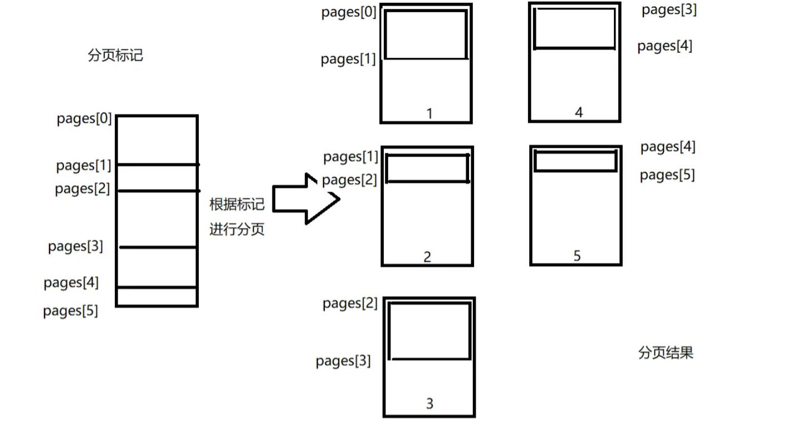
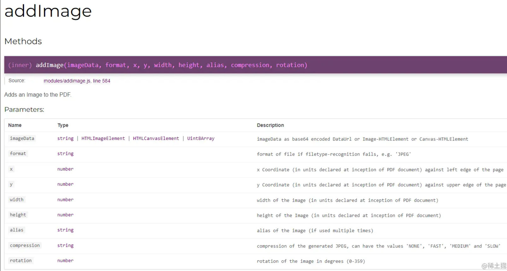
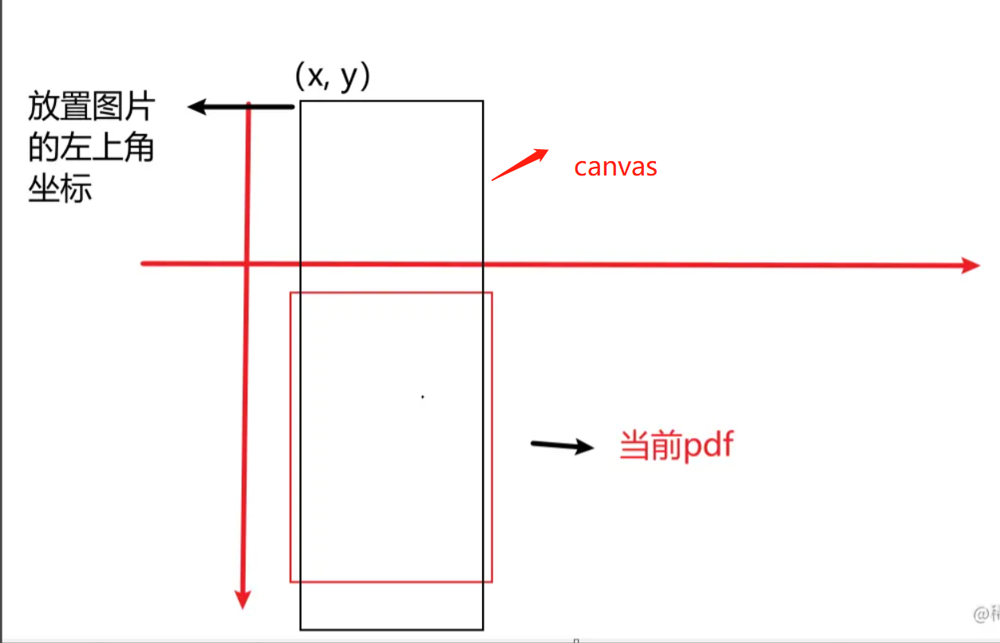
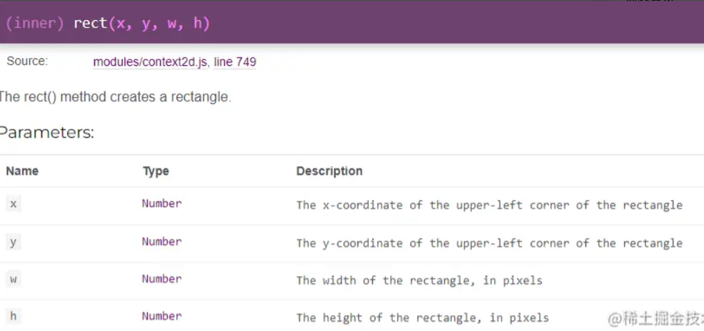
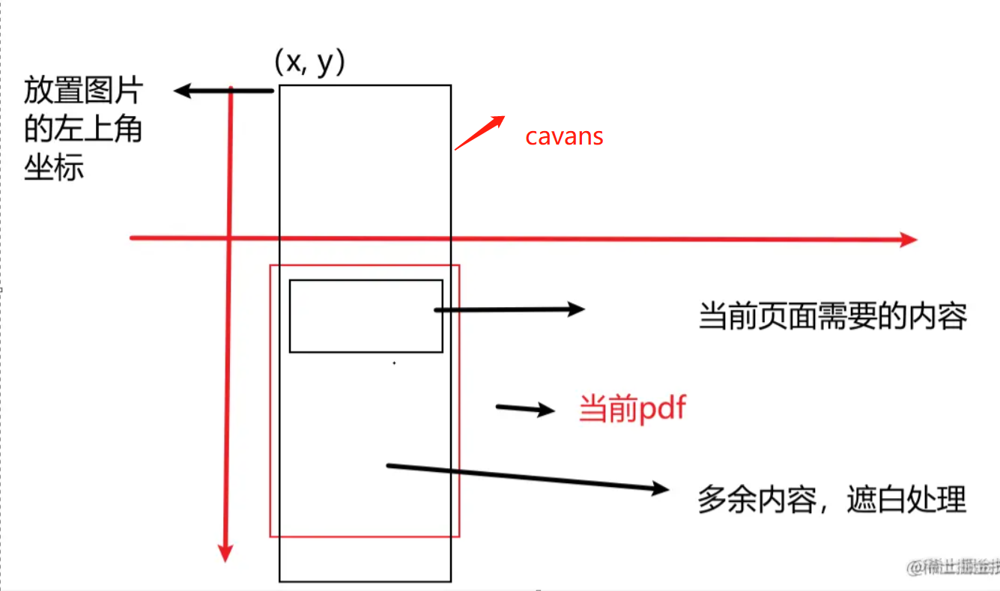

## 纯前端导出 pdf

基于**html2canvas**、**jspdf**，封装

## 插件依赖

```js
npm install html2canvas
npm install jspdf
```

## 场景

分页截断,富文本,表格处理, 页眉页脚, 页边距,自定义第一页页眉页脚, 清晰度等

## 处理思路

通过 **深度搜索优先遍历** ，从顶部遍历需要转换的 HTML 节点， 并将节点分为三种情况进行处理

1. 普通节点。

2. 需要进行分页处理并且内部可能包含也需要分页处理子节点的节点。

3. 需要进行分页内部不包含需要分页处理的节点，即深度搜索的终点节点

通过从高到低遍历维护一个分页数组 pages，该数组记录每一页的起始位置，如：pages[0] 对应 第一页起始位置， pages[1] 对应 第二页起始位置



通过深度遍历后得出每页起始位置的数组，遍历数组，通过**jspdf**的**addImage**接口对**canvas**进行画面截取，由于**addImage**只能**固定位置的左上角起始点**，不能进行**非常精确的上下定位截取**（下一节会详解`addImage`)，会造成**截取多余的内容**（如上图**页面 1**中**pages[1]** 下方的内容会和 **页面 2** 中 **pages[1]** 下方的内容会一样（除长度外），而**页面 1**中**pages[1]** 下方的内容是多余的（是属于**页面 2**的内容））因此需要对页面不需要的内容 `使用jspdf的addBlank进行空白遮挡处理`。

### jsPDF.addImage`详解

官方文档链接[addImage - Documentation (artskydj.github.io)](https://link.juejin.cn/?target=https%3A%2F%2Fartskydj.github.io%2FjsPDF%2Fdocs%2Fmodule-addImage.html)



1、image：表示要插入的图片资源，可以是图片文件的路径或者 base64 编码字符串。

2、format：表示要插入的图片格式，包括：‘JPEG’, ‘PNG’, ‘GIF’, ‘BMP’, ‘TIFF’, ‘RAW’, ‘JPEG2000’。

3、x：图片在 PDF 中的 x 轴坐标，单位为 pt（点）。

4、y：图片在 PDF 中的 y 轴坐标，单位为 pt（点）。

5、width：图片在 PDF 中的宽度，单位为 pt（点）。

6、height：图片在 PDF 中的高度，单位为 pt（点）。

7、alias（可选）：指定图片资源的别名。

8、compression（可选）：指定图片的压缩质量，取值为 0-1 之间的浮点数。

9、rotation（可选）：指定图片的旋转角度，取值范围为 0-360 之间的整数。

需要注意的点是**坐标（x,y）** 的取值， (x,y)对应的是添加图片的左上角取值，宽高则是根据转化成 canvas 的宽高取值，图解如下


因此在对一个长图片进行截取时，往往将 y 值设为负数，也就是让很长的 cavans 往上拉，让需要截取图片的起始位置落于当前的 pdf 页面内，在当前案例下，每一页的图片摆放坐标**y = -pages[i]**


### `jsPDF.rect`详解

文档链接 [context2d - Documentation (artskydj.github.io)](https://link.juejin.cn/?target=https%3A%2F%2Fartskydj.github.io%2FjsPDF%2Fdocs%2Fmodule-context2d.html%23~rect)



该接口的参数 **（x,y）坐标、宽高** 与 addImage 接口的一致 当前 pdf 页需要的内容的高度为 `pages[i] - pages[i-1]`， 除去顶部这个高度外以下的内容都是不需要的，因此得到每一页添加空白的**y 坐标值为**`- pages[i] - pages[i-1]`，高度 h 为`一页pdf的高度（此处为A4页的高度） - pages[i] - pages[i-1]`，宽度为 A4 宽度，x 为 0， 图解如下：



### 深度优先遍历三种类型的节点（具体过程看源码都有注释）

通过深度优先遍历操作，可以从高到低去遍历需要进行跨页判断的元素，检测是否跨页，并记录分页点，从而避免跨页问题。
（下面说到的根元素节点是指我们传进来的最外层那个节点，上部分说到的都是在根元素 top 为 0 情况，实际上我们还要减去根元素 top 再判断分页的）

### 1. 普通节点（ 即不指定特定类名的节点）

当遍历到普通节点，即不需要进行分页判断的节点时，只需要进行 **2 步操作**：

1. **（当前节点距离顶部的高度-根元素距离顶部高度) - pages 最后一位元素的值（即上一页的分界点）得出的差值是否 大于 页面的高度** ， 如果大于,则证明当前节点已经跨页，进行操作**pages.push(pages[pages.length - 1] + 一页 PDF 的高度)**
2. 对子节点进行深度遍历

备注：普通节点分页时候是直接 pages.push(pages[pages.length - 1] + 一页 PDF 的高度， 因此可能出现刚好上一个超出一页被截断的问题，但是这种情况很少会出现，不过如果发现被截断，可以通过指定超出部分元素加上 pdf-ground-item 类名，也就是手动指定深度终点，这样就会分到下一页，具体参数看 Html2Pdf 文件。

### 2. 需要进行跨页判断，且内部也含有 `可能跨页/需要进行跨页判断` 的节点（即设置了 pdf-ground 类名分组的节点）

当元素进行到该类型的节点时， 需要进行**3 步操作**：

1. 需要进行与**普通节点第一步**相同的判断
2. **（(当前节点距离顶部的高度-根元素距离顶部高度) + 节点自身的高度） 是否大于 （pages 最后一位元素（即当前页 顶部位置） + 一页 PDF 的高度（当前指 A4 的高度））**

如果条件为真，则证明该节点属于跨页元素，**(当前节点距离顶部的高度-根元素距离顶部高度)的 top** 是分页点，往`pages`中 **push** `top`

1. 且由于内部还存在需要进行跨页检测的节点，因此需要对子节点进行深度遍历

### 3. 需要进行跨页判断，但内部不含有`可能跨页/需要进行跨页判断` 的节点， 即深度终点（图片、表格 row 或手动设置类名 pdf-ground-item 的节点）

该节点只需要进行 内部含有`可能跨页/需要进行跨页判断` 的节点 的第一第二步操作， 由于内部不再含有，因此不需要遍历子节点，为搜索的叶子节点。

### 4.强制分页点（设置了 splitName 的节点）

某些情况下我们想要某个元素单独新的一页开始，那么需要设置强制分页类名，遍历到强制分页的节点，会直接往`pages`中 **push** `top`，也就是标记要重开一页。

## 使用

引入 utils/Html2Pdf 类,其余两个文件是我参考时候的,我自己重新封装了一遍,然后看这个文件的参数就知道了,或者看看使用案例.
目前纸张是 A4,没有做其他纸张自定义，可以自行优化

支持参数：

```js
/**
 * 生成pdf
 * @param {Object} param
 * @param {HTMLElement} param.element - 需要转换的dom根节点
 * @param {number} [param.contentWidth=550] - 一页pdf的内容宽度，0-595
 * @param {number} [param.contentHeight=800] - 一页pdf的内容高度，0-842
 * @param {string} [param.outputType='save'] - 生成pdf的数据类型，默认是save下载下来，'file': pdf文件，'print': 打印，其他支持的类型见http://raw.githack.com/MrRio/jsPDF/master/docs/jsPDF.html#output
 * @param {number} [param.scale=window.devicePixelRatio * 2] - 清晰度控制,canvas放大倍数,默认像素比*2
 * @param {string} [param.direction='v'] - 纸张方向，h横向，v竖向，默认A4纸张
 * @param {string} [param.fileName='document.pdf'] - pdf文件名，当outputType='file'时候，需要加上.pdf后缀
 * @param {number} param.baseX - pdf页内容距页面左边的高度，默认居中显示，为(A4宽度 - contentWidth) / 2)
 * @param {number} param.baseY - pdf页内容距页面上边的高度，默认 15px
 * @param {HTMLElement} param.header - 页眉dom元素
 * @param {HTMLElement} param.footer - 页脚dom元素
 * @param {HTMLElement} param.headerFirst - 第一页的页眉dom元素（如果需要指定第一页不同页眉时候再传这个,高度可以和其他页眉不一样)
 * @param {HTMLElement} param.footerFirst - 第一页页脚dom元素
 * @param {string} [param.groupName='pdf-group'] 类名- 给dom添加组标识的名字，分组代表要进行分页判断，当前组大于一页则新起一页，否则接着上一页
 * @param {string} [param.itemName='pdf-group-item'] 类名 - 给dom添加元素标识的名字,设置了itemName代表此元素内容小于一页并且不希望被拆分，子元素也不需遍历，即手动指定深度终点，优化性能
 * @param {string} [param.editorName='pdf-editor'] 类名 - 富文本标识类
 * @param {string} [param.tableSplitName='el-table__row'] 类名 - 表格组件内部的深度节点
 * @param {string} [param.splitName='pdf-split-page'] 类名 - 强制分页，某些情况下可能想不同元素单独起一页，可以设置这个类名
 * @param {string} [param.message=false] - 是否显示当前生成页数状态
 * @param {string} [param.isTransformBaseY=false] - 是否将baseY按照比例缩小(一般固定A4页边距时候可以用上)
 * @param {Array} [param.positionGroup=[]] - 需要计算位置的元素属性,不需要传，需要元素上设置，格式是 data-position='xxx'，需要同时在节点上加上param.itemName，如<p data-position='p-position' class='pdf-group-item'></p>
 * @returns {Promise} 根据outputType返回不同的数据类型,是一个对象，包含pdf结果及需要计算的元素位置信息
 */
```

案例运行:

```js
npm install

npm run serve
```

##

## 注意点：

### 内部滚动条导致滚动部分被截断问题

当表格列数过多，表格内部产生滚动条，直接导出的话滚动条外是被截掉的，其实不管是表格还是其他组件，内部产生滚动条都是会被截掉的。

解决方案 1：
尽量不要产生内部滚动条，如果避免不了，那么可以考虑导出时候将样式更改，把宽度加大到不出现滚动条，同时可以考虑将页面方向换成横向，不然可能在 pdf 中字看起来过小。这个方案缺点是导出时候页面会看起来突然变宽了，不过可以加 loading 蒙版遮蔽一下。

决方案 2：
如果不想导出时候更换样式，可以考虑渲染多一个，设置定位不可见，这个宽度就设置不出现滚动条为止，不过这样要多渲染，性能可能有点影响，内容多的话。

不管哪个，目的都是导出时候不让内部产生滚动条！。

### 导出内容过多，后面页面全是空白或者黑色

这个是浏览器限制 canvas 最大绘制长度问题，不同浏览器有些不一样。

解决：可以分多个 cavans，用完 cavans 就销毁，最后合并。

### 图片在 pdf 显示不出

出现这个，那么就是画布被污染导致绘制失败，除了配置 html2canvas 设置可跨域加载图片外，同时要看这个图片链接本身是否开启了跨域访问，需要允许才可以。

当然，base64 的图片不会出现这种问题，如果图片小，可以先转成 basse64 解决。

### 样式问题

目前代码节点遍历,并未考虑节点 dom 定位、边距、边框等因素，需在 dom 里自行考虑，如将 box-sizing 设置为 border-box

### 模糊的问题

通过设置 html2canvas 的 `scale` 参数， 对`canvas`进行等比放大，可以使`canvas`生成的图片更清晰，但是放大越大生成的文件也就越大，默认像素比\*2，基本满足需求。

**大致原理：**
使用扩大 Canvas 画布宽高并缩放绘制内容的方式来提高图像清晰度。

具体来说，如果将 Canvas 画布宽高扩大两倍，再将绘制的图像通过 scale() 方法在水平和垂直方向同时缩小一半（context.scale(0.5, 0.5)），最终呈现的图像占用的像素相比原来没有变化，但是细节更加清晰，像素点更加紧密。

这种方式能够提高清晰度的原因是，当将 Canvas 宽高扩大时，每个像素点的密度也会相应增加，细节更加清晰。而 scale() 方法的缩小是在突出像素的细节的同时，对整个图像进行压缩，使得图像占用的像素数不变，从而在原有像素上为图像提高了清晰度。不过需要注意，如果扩大倍数过高，图像可能会出现失真等问题，这时需要调整扩大倍数和缩放比例来达到最佳效果。

### 截断问题

如果直接使用本方法出现截断问题，那么需要手动指定一下深度终点，因为分页判断对于普通元素是根据高度差判断的，可能刚好那个元素在分页点，当然这种情况不是必现的，所以当出现这种情况，找到对应截断元素，添加上类名 pdf-group-item ,这时候这个元素会被当成深度终点，子元素不会被遍历，会一整块计算是否超过一页。

建议：
建议都对小元素手动添加上 pdf-group-item 类名，也就是你自己手动分成很多小块，这样就能避免出现截断问题。可以参考案例的 pdfWord.vue 文件。

```js
// canvas元素
const canvas = await html2canvas(element, {
  // allowTaint: true, // 允许渲染跨域图片
  scale: window.devicePixelRatio * 2, // 增加清晰度
});
```

### 其他

1. pdf.addImage 是以当前页算的坐标，也就是像页眉每页添加时候左上角坐标开始都是 0，0，而不是加上前面的页数,所以看原理时候不要理解错了.
2. 计算每个元素的 top 值后要减去根元素 top，再进行分页判断

3. 深度优先算法

   深度优先搜索（Depth-First-Search），简称 DFS。最直观的例子就是“走迷宫”。假设你站在迷宫的某个岔路口，然后想找到出口。你随意选择一个岔路口来走，走着走着发现走不通的时候，你就回退到上一个岔路口，重新选择一条路继续走，直到最终找到出口。这种走法就是一种深度优先搜索策略。

## 缺点：

需要手动计算分页点。 由于是通过**转化成图片来生成 PDF**,，而且各类浏览器对于**canvas**的高度存在限制，当转化为 canvas 的 HTML 元素过高/宽，canvas 超出浏览器限制后，无法转化图片，生成的 PDF 就是一个空白/纯黑的文档。 可以通过分割 HTML 元素来规避这个问题，但是操作会更加繁复。

目前发现 40 页左右正常，超过 40 页就出现空白，也就是到浏览器限制了，测试 360,edge,chrome 都差不多 35—40 之间

## 服务端生成

可参考链接：[nuxt3 搭建中间层服务 html 生成 PDF 方案： 基于 nuxt3 + puppeteer - 掘金 (juejin.cn)](https://juejin.cn/post/7165902819701522445)

[Puppeteer 将动态 html 页面生成 pdf（终极解决方案）] https://juejin.cn/post/7143596746856202254

## 参考来源:

1.  掘金： https://juejin.cn/post/7138370283739545613
2.  [vue-pdf2](https://gitee.com/jseven68/vue-pdf2)
3.  jsPDF - Documentation (artskydj.github.io)
4.  配置型 | HTML2CANVAS 中文文档 (allenchinese.github.io)
5.  【原创】jspdf+html2canvas 生成多页 pdf 防截断处理 - 简书 (jianshu.com)
